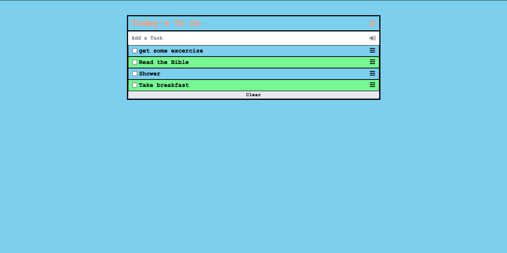
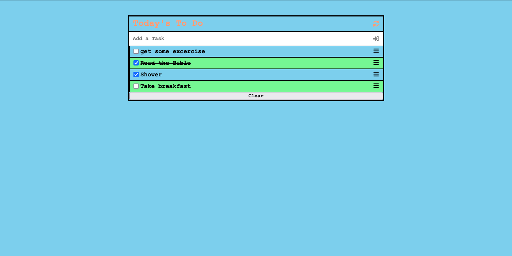

# To Do List

> A Simple App for a User to store their daily tasks.

[Live Demo](https://emmyobonyo.github.io/ToDoList-JS-Project/dist/)




- Hard-coded tasks are loaded from local storage
- A User can cross out completed tasks.
- Completed Tasks will come back as completed on Refresh.

## Built With

- HTML, CSS and Javascript

## Getting Started
- Usong Terminal (Mac) or Command Line (PC) Navigate to the folder on your computer where you'd like to store the project.
- Type this command once in your deisred directory ```git clone https://github.com/emmyobonyo/ToDoList-JS-Project.git```
- Install ```npm``` and then run ```npm start```
## Authors

👤 **Emmanuel Obonyo**

- GitHub: [@emmyobonyo](https://github.com/emmyobonyo)
- Twitter: [@emmyobonyo](https://twitter.com/emmyobonyo)
- LinkedIn: [Emmanuel Obonyo](https://www.linkedin.com/in/emmanuel-obonyo-3728a2200/)
## 🤝 Contributing

Contributions, issues, and feature requests are welcome!

## Show your support

Give a ⭐️ if you like this project!

## Acknowledgments

- Thanks to [Microverse](https://microverse.org) for providing the linters.

## 📝 License

This project is [MIT](./MIT.md) licensed.
